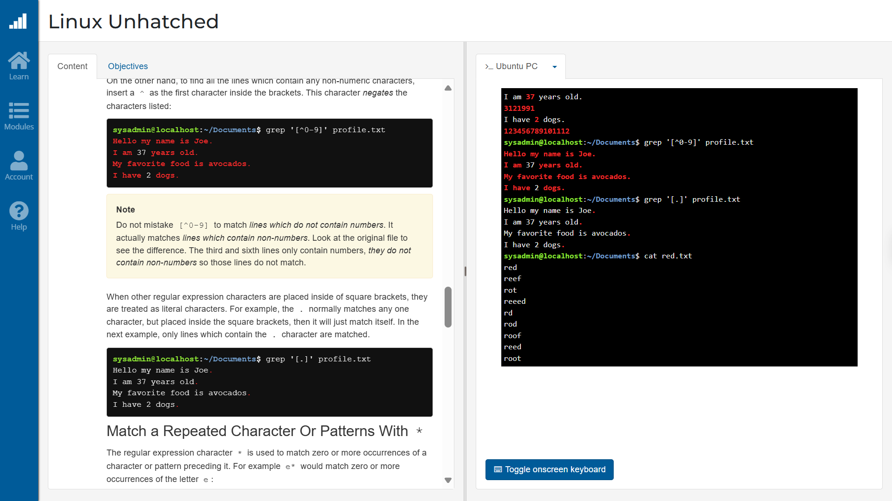

# Cisco's Linux Unhatched
“My progress through Cisco’s Linux Unhatched labs"

This repository documents my journey through Cisco’s Linux Unhatched labs, including commands, insights, and screenshots.

## Progress Tracker
| Lab    | Status        | Screenshot                     |
|--------|---------------|--------------------------------|
| Lab 1  | ✅ Completed   |        |
| Lab 2  | ✅ Completed   |        |
| Lab 3  | ✅ Completed   |      |
| Lab 4  | ✅ Completed   |      |
| Lab 5  | ✅ Completed   |        |
| Lab 6  | ✅ Completed   |        |
| Lab 7  | ✅ Completed   |      |
| Lab 8  | ✅ Completed   |        |
| Lab 9  | ✅ Completed   |        |
| Lab 10 | ✅ Completed   |      |
| Lab 11 | ✅ Completed   |      |

## Labs Completed

### Lab 1
- **Commands:** `ls`, `ls -l`, `ls -r`, `ls -lr`

**What They Do:**
- `ls`: Lists directory contents
- `ls -l`: Lists contents in long format, showing permissions, ownership, and timestamps
- `ls -r`: Lists contents in reverse order
- `ls -lr`: Combines both options—lists contents in long format and reverse order

**Insights:**
- Got "Permission denied" when running `ls` in some directories → learned about file permissions
- Typing `ls-r` gave an error → spacing matters (`ls -r` is correct)

**Screenshot:**  


---

### Lab 2
- **Commands:** `clear`, `pwd`, `cd`, `cd ..`, `cd .`, `cd ~`

**What They Do:**
- `clear`: Clears the terminal screen (tidies up the workspace).
- `pwd`: Prints the working directory (shows your current location in the filesystem).
- `cd [path]`: Changes directory to the specified path.
- `cd /`: Moves to the root directory (the top of the filesystem tree).
- `cd ..`: Moves up one level to the parent directory.
- `cd .`: Refers to the current directory (not very useful with `cd`, but important later).
- `cd ~`: Returns to the home directory of the current user (`/home/sysadmin`).

**Concepts Learned:**
- Directories in Linux are like folders in Windows/Mac.
- A **path** is a list of directories separated by `/`.
- **Absolute paths** always start with `/` (e.g., `/home/sysadmin`).
- **Relative paths** use shortcuts:
  - `..` → parent directory
  - `.` → current directory
  - `~` → home directory of the logged-in user

**Insights:**
- Learned that Linux always starts you in your home directory (`/home/sysadmin`) when you log in as `sysadmin`.
- Understood the difference between absolute and relative paths.
- Practiced navigating between directories using `cd` and shortcuts.

**Screenshot:**  


---
### Lab 3
- **Commands:** `ls`, `ls -l`, `ls -lt`, `ls -lS`, `ls -lr`, `ls -lSr`

**What They Do:**
- `ls`: Lists files in the current directory (alphabetical by default).
- `ls -l`: Long listing with details (file type, permissions, hard link count, owner, group, size, timestamp, filename).
- `ls -lt`: Sorts by timestamp (newest first).
- `ls -lS`: Sorts by file size (largest first).
- `ls -lr`: Reverses the order (alphabetical Z→A).
- `ls -lSr`: Sorts by size, smallest first.

**Concepts Learned:**
- **File types:**  
  - `-` regular file, `d` directory, `b` block device, `c` character device,  
  - `s` socket, `p` pipe, `l` symbolic link.
  
- **Permissions:** Control read (`r`), write (`w`), and execute (`x`) access for owner, group, and others.
- **Ownership:** Split into **user** (creator/owner) and **group**.
- **Hard link count:** Number of directory entries pointing to a file (directories always have at least 2).
- **File size:** Shown in bytes; directories often show multiples of the filesystem block size (commonly 4096 bytes).
- **Timestamps:** Show last modification time.
- **Symbolic links:** Display with `->` pointing to the target file.

**Insights:**
- `/var/log` is a great practice directory because it contains many file types, different owners/groups, and varied sizes/timestamps.
- Sorting options (`-t`, `-S`, `-r`) make it easier to analyze files by time, size, or order.
- Learned that a directory’s size reflects the space used to store its entries, not the total size of files inside.

**Why /var/log is used:**
- Contains a wide variety of files (regular files, directories, links).
- `ls -l /var/log` will list every file and directory entry, even if they have different owners, groups, or permissions.
- You can always *see* the files and their details (permissions, ownership, size, timestamps), but you may not be able to open or read all of them without the right privileges (e.g., some require root).
- Safe to explore with `ls` because you’re only listing, not modifying.
- Logs reflect real system activity, so sorting and listing options show meaningful differences.
- Other directories (like `/home`) may not have enough variety to demonstrate permissions, ownership, and sorting.

📦 **Block Size Visualization**  
Even a tiny file (like 1 byte) still consumes a full filesystem block (commonly 4096 bytes). 
This is why directories often show sizes like 4096 or 8192 — it reflects the space used for their entries, not the total size of files inside.

**Screenshot:**


---

### Lab 4
- **Commands:** `su`, `su -`, `su -l`, `su --login`, `exit`, `sudo`, `sudo -u`

**What They Do:**
- `su`: Switches to another user account (default is root) by opening a new shell.
- `su -`, `su -l`, `su --login`: Starts a login shell with the new user’s environment fully configured.
- `exit`: Logs out of the current shell and returns to the previous user.
- `sudo`: Executes a single command with administrative privileges (without switching users).
- `sudo -u [user] [command]`: Executes a command as a specified user.

**Concepts Learned:**
- **Administrative access** is required for sensitive commands (e.g., system-level operations).
- **`su` vs `sudo`:**
  - `su` opens a new shell as another user (usually root).
  - `sudo` runs a single command as another user (default is root), without switching shells.
- **Login shell options** (`su -`, `su --login`) ensure the new shell uses the target user’s environment.
- **Password security:** Passwords (like `netlab123`) are required but not shown when typed.
- **Prompt change:** When using `su`, the shell prompt changes to reflect the new user (e.g., `root@localhost`).
- **Steam Locomotive (`sl`) command** was used to demonstrate permission control:
  - Fails when run as `sysadmin`.
  - Succeeds when run as `root` via `su` or `sudo`.

**Insights:**
- Switching users with `su` gives full root access, which can be risky if not handled carefully.
- Using `sudo` is safer for one-off commands—it limits the scope of elevated access.
- Learned how to verify which user is active based on the shell prompt.
- Practiced using `exit` to safely return to the original user.

**Screenshot:**  
  


---

### Lab 5
- **Commands:** `cd`, `ls -l`

**What They Do:**
- `cd ~/Documents`: Navigates to the Documents folder in the home directory.
- `ls -l hello.sh`: Displays file details including type, permissions, owner, group, size, and timestamp.

**Concepts Learned:**
- File types: `-` for regular files, `d` for directories.
- Permissions are grouped into **Owner**, **Group**, and **Others**—each with `r` (read), `w` (write), `x` (execute).
- Only one permission set applies based on your relationship to the file.
- Ownership fields show who owns the file and which group it belongs to.

**Insights:**
- Permissions affect how users interact with files and directories.
- Example: `-r--rw-rwx` means the owner has read-only access, while others have more.
- Owner permissions take precedence—even if the owner is in the group.

**Screenshot:**  


---

### Lab 6
- **Commands:** `chmod`, `ls -l`, `./hello.sh`

**What They Do:**
- `chmod u+x hello.sh`: Adds execute permission for the user owner of the file.
- `ls -l hello.sh`: Verifies permission changes.
- `./hello.sh`: Executes the script from the current directory.

**Concepts Learned:**
- **chmod** stands for “change mode” (not “change permission”) because permissions were historically called modes of access.
- **Symbolic method** of `chmod` uses:
  - `u`, `g`, `o`, `a` to target user, group, others, or all.
  - `+`, `-`, `=` to add, remove, or set exact permissions.
  - `r`, `w`, `x` for read, write, and execute.
- Only the **file owner or root** can change permissions.
- Without execute permission, a script like `hello.sh` cannot be run—even if readable.
- Adding `x` for the user owner enables script execution.

**Insights:**
- Using `chmod u+x` is a safe way to grant execution rights without affecting group or others.
- `./hello.sh` runs the script from the current directory—this avoids relying on the system’s PATH.
- After permission is granted, the script runs successfully and prints “Hello World!”

**Screenshot:**  


---

### Lab 7

#### 🔐 Changing File Ownership

**Commands:** `chown`, `sudo`, `ls -l`, `./hello.sh`

**What They Do:**
- `chown [OWNER] FILE`: Changes the user owner of a file (requires `sudo`).
- `sudo chown root hello.sh`: Transfers ownership of `hello.sh` to root.
- `ls -l hello.sh`: Verifies ownership change.
- `sudo ./hello.sh`: Executes the script as root since only root has execute permission.

**Insights:**
- Only root can change file ownership.
- After ownership changes, permissions must be reassessed—execution may fail if the new owner is the only one with `x` permission.
- Using `sudo` allows execution under root privileges.

---

#### 📄 Viewing File Contents

**Commands:** `cat`, `head`, `tail`

**What They Do:**
- `cat [FILE]`: Displays the entire file—best for small files.
- `head [FILE]`: Shows the first 10 lines.
- `tail [FILE]`: Shows the last 10 lines.
- `head -n [number] [FILE]`: Views a specific number of lines from the top.
- `tail -n [number] [FILE]`: Views a specific number of lines from the bottom.

**Insights:**
- Use `cat` for quick checks.
- Use `head` and `tail` for large or frequently updated files.
- `-n` option customizes output length for better control.

---

**Screenshot:**  


---

### Lab 8

#### 📁 Copying Files with `cp`

**Commands:** `cp`, `diff`, `ls`

**What They Do:**
- `cp [SOURCE] [DESTINATION]`: Copies a file from one location to another.
- `cp /etc/passwd .`: Copies `/etc/passwd` into the current directory (`.` = current directory).
- `cp /etc/passwd passwd_backup`: Creates a copy named `passwd_backup` in the current directory.
- `ls`: Lists files to confirm the copy exists.


#### 🔍 Verifying the Copy with `diff`

**Commands:** `diff`

**What They Do:**
- `diff FILE1 FILE2`: Compares two files line by line.
- `diff /etc/passwd passwd_backup`: Confirms whether the backup is identical to the original.
  - If there's **no output**, the files are **identical**.
  - If there is output, it shows the differences line by line.

#### 🔐 Permission Requirements

**To successfully copy a file:**
- ✅ **Read permission** on the source file.
- ✅ **Execute permission** on the source directory.
- ✅ **Write + execute permission** on the destination directory.

**Common writable directories:**
- Your home directory (`~/`)
- `/tmp` — a shared space for temporary files

#### 💡 Use Cases for Copying Files

- Create backups before editing.
- Transfer files to external devices.
- Use existing files as templates for new ones.
- Compare versions using `diff`.

**Screenshot:**  


---

### Lab 9

#### 📂 Moving Files with `mv`

**Commands:** `mv`, `ls`, `cd`

**What They Do:**
- `mv [SOURCE] [DESTINATION]`: Moves a file from one location to another.
- `mv people.csv Work`: Moves `people.csv` into the `Work` directory.
- `mv numbers.txt letters.txt alpha.txt School`: Moves multiple files into the `School` directory.
- `mv animals.txt zoo.txt`: Renames `animals.txt` to `zoo.txt` within the same directory.
- `ls`: Lists files to confirm the move or rename.
- `cd ~/Documents`: Navigates to the working directory.

#### 🔍 Verifying the Move

**Commands:** `ls`

**What They Do:**
- `ls Work`: Confirms that `people.csv` was successfully moved.
- `ls School`: Verifies that multiple files were moved.
- `ls`: Shows that `animals.txt` was renamed to `zoo.txt`.

#### 🔐 Permission Requirements

**To successfully move a file:**
- ✅ **Write + execute permission** on the source directory.
- ✅ **Write + execute permission** on the destination directory.

**Why It Matters:**
- Without execute permission, you can’t access the directory.
- Without write permission, you can’t modify its contents (e.g., move or rename files).

#### 💡 Use Cases for Moving Files

- Organize files into folders (e.g., move documents into `Work` or `School`).
- Rename files for clarity or versioning.
- Clean up clutter by relocating files.
- Batch move multiple files with a single command.

**Screenshot:**  
 

---

### Lab 10

#### 🗑️ Removing Files with `rm`

**Commands:** `rm`, `ls`, `cd`, `-r`, `-R`

**What They Do:**
- `rm [OPTIONS] FILE`: Removes files or directories.
- `rm filename`: Deletes a regular file.
- `rm -r directory`: Recursively removes a directory and all its contents.
- `cd ~/Documents`: Changes into the `Documents` directory.
- `ls`: Lists files to verify removal.

**Important:**  
Unlike desktop systems, Linux does **not** have a “trash can.” 
When you delete a file with `rm`, it is **permanently removed**.

**🔐 Permission Requirements**
- To successfully delete a file:
- ✅ Write + execute permission on the directory containing the file.

#### ⚠️ Understanding Destructive Commands

**Example:**
```bash
sudo rm -rf /
```

**Impact & Recovery**
**Impact:**
- System files, user data, and boot components are wiped.
- Even basic tools needed for recovery are deleted.

**Why Recovery Is Hard:**
- OS becomes unbootable.
- No shell or package manager remains.
- Recovery requires a full backup or clean reinstall.

**How to Protect Yourself**
- Back up files regularly.
- Use safer deletion:
```bash
rm -i filename
```
- Avoid `sudo` with destructive commands.
- Lock critical files:
```bash
chattr +i filename
```

**Screenshot:**  


---

### Lab 11

#### 🔍 Filtering Input with `grep`

**Commands:** `grep`, `cd`, `cp`, `cat`

**What They Do:**
- `grep [OPTIONS] PATTERN [FILE]`: Searches text and displays lines matching a pattern.  
- `cd ~/Documents`: Changes into the `Documents` directory.  
- `cp /etc/passwd .`: Copies the `/etc/passwd` file to the current directory.  
- `cat filename`: Displays the contents of a file.  

**Example:**
```bash
cd ~/Documents
cp /etc/passwd .
grep sysadmin passwd
````

**Output:**

```
sysadmin:x:1001:1001:System Administrator,,,,:/home/sysadmin:/bin/bash
```

This line is the `/etc/passwd` entry for the `sysadmin` user.

---

#### ⚙️ Regular Expressions (Regex)

Regular expressions enhance search capability in `grep`.

**Basic Regex Characters:**

| Character | Meaning                                      |
| --------- | -------------------------------------------- |
| `.`       | Any single character                         |
| `[ ]`     | Any one specified character                  |
| `[^ ]`    | Any one *not* specified character            |
| `*`       | Zero or more of the previous character       |
| `^`       | Match pattern at the **beginning** of a line |
| `$`       | Match pattern at the **end** of a line       |

**Extended Regex Characters (use `grep -E` or `egrep`):**

| Character | Meaning                                    |            |
| --------- | ------------------------------------------ | ---------- |
| `+`       | One or more of the previous pattern        |            |
| `?`       | The preceding pattern is optional          |            |
| `{ }`     | Specify minimum, maximum, or exact matches |            |
| `         | `                                          | Logical OR |
| `( )`     | Group expressions                          |            |

---

#### 🧱 Basic Pattern Examples

**Search for a literal pattern:**

```bash
grep sysadmin passwd
```

**Anchor Characters:**

```bash
grep '^root' /etc/passwd     # Match lines starting with "root"
grep 'r$' alpha-first.txt    # Match lines ending with "r"
```

**Match a single character (`.`):**

```bash
grep 'r..f' red.txt
```

Matches: `reef`, `roof`

**Match character ranges (`[]`):**

```bash
grep '[0-9]' profile.txt
```

Matches lines containing numbers.

**Negate characters (`[^ ]`):**

```bash
grep '[^0-9]' profile.txt
```

Matches lines with non-numeric characters.

**Match repeated characters (`*`):**

```bash
grep 're*d' red.txt
```

Matches: `red`, `reed`, `reeed`

**Multiple options with ranges:**

```bash
grep 'r[oe]*d' red.txt
```

Matches: `red`, `rod`, `reed`

---

#### 💡 Standard Input Mode

If no file is provided, `grep` reads from **standard input**:

```bash
grep pattern
```

Type text and press **Ctrl + D** to end input.

---

#### 🏠 Return to Home Directory

```bash
cd ~
```

---

**Summary:**

* `grep` filters and searches for text patterns efficiently.
* Regular expressions allow complex searches.
* Use quotes (`' '`) to protect patterns from shell interpretation.

**Screenshot:**





---

### Lab 12

#### 📴 Shutting Down the System with `shutdown`

**Command:** `shutdown [OPTIONS] TIME [MESSAGE]`

**Purpose:**  
Safely brings the system down while notifying all logged-in users and preventing new logins before shutdown.

---

#### ⚙️ Steps

1. Switch to the root account:  
   `su -`  
   *(Password: netlab123)*

2. Run an immediate shutdown:  
   `shutdown now`

   **Output Example:**  
   The system is going down for maintenance NOW!

3. Schedule a shutdown:  
   - `shutdown +5` → in 5 minutes  
   - `shutdown 01:30` → at 1:30 AM  
   - `shutdown now` → immediately

4. Add a custom message:  
   `shutdown +1 "Goodbye World!"`

---

#### 🕒 Check System Time

`date` → displays current system time (often in UTC).  
Example: `Sat Oct 3 22:15:58 UTC 2020`

---

#### 🧠 Summary

- Requires root privileges  
- Accepts time formats: `now`, `+minutes`, or `hh:mm`  
- Optionally includes a broadcast message  
- Safely stops or reboots the system  

**Screenshot:**  


---

### Lab 13

#### 🌐 Network Configuration with `ifconfig` and `ping`

**Commands:** `ifconfig`, `ping`, `iwconfig`

**Purpose:**  
View and test network connections, IP addresses, and interface activity.

---

#### ⚙️ Key Commands

- `ifconfig` → Displays active network interfaces and configuration.  
  - Example: `eth0` with IPv4 `192.168.1.2` means the interface is active (UP).  
  - `lo` (loopback) is used for internal network communication (address `127.0.0.1`).

- `iwconfig` → Similar to `ifconfig`, but for wireless interfaces.

- `ping [IP or HOSTNAME]` → Tests connectivity by sending network packets.  
  - `ping -c 4 192.168.1.2` → Sends 4 packets to the target.  
  - Successful replies confirm network reachability.  
  - “Destination Host Unreachable” means no response.

---

#### 🧠 Notes

- Use `Ctrl + C` to stop continuous ping tests.  
- Ping may fail if a system or network blocks ICMP for security.  
- You can also ping domain names (e.g., `ping yahoo.com`) to verify DNS resolution.

---

#### 🔚 Exit Root Mode

Use `exit` to return to the normal user shell after finishing tests.

**Screenshot:**  


---

### Lab 14

#### 🧩 Viewing Processes with `ps`

**Command:** `ps [OPTIONS]`

**Purpose:**  
Displays active processes on the system, showing what’s running and under which user.

---

#### ⚙️ Key Commands

- `ps` → Shows processes running in the current terminal.  
  Example output includes:
  - **PID** – Process ID (unique identifier)  
  - **TTY** – Terminal associated with the process  
  - **TIME** – Total CPU time used  
  - **CMD** – Command that started the process  

- `ps -e` → Displays *all* processes on the system.  
- `ps -ef` → Displays detailed information about each process, including parent processes and command options.

---

#### 🧠 Notes

- Each command executed creates a *process* that runs with the user’s privileges.  
- Regular users can only control their own processes.  
- The `root` user can manage or stop any process.  
- Look for the `ps` command itself listed in the output — it’s included because it’s a running process too.

---

**Screenshot:**  


---
### Lab 15

#### 📦 Package Management with `apt-get`

**Commands:** `apt-get`, `apt-cache`, `dpkg`, `sudo`

**Purpose:**  
Manage software installation, updates, and removal on Debian-based systems like Ubuntu.

---

#### ⚙️ Key Concepts

- **Package Management:**  
  Handles installing, updating, and removing software efficiently.  
  Ubuntu uses the **APT** system, a front-end to **dpkg**.

- **Administrative Access:**  
  Most commands require `sudo` privileges (password: `netlab123`).

---

#### 🧩 Common Commands

- **Update Package List:**  
  `sudo apt-get update`  
  Refreshes the list of available packages.

- **Search for Packages:**  
  `apt-cache search [keyword]`  
  Example: `apt-cache search cow` → finds the *cowsay* package.

- **Install a Package:**  
  `sudo apt-get install cowsay`

- **Run Installed Program:**  
  `cowsay 'NDG Linux Unhatched'`  
  🐄 → Outputs a talking ASCII cow with your message.

- **Upgrade Installed Packages:**  
  `sudo apt-get upgrade`  
  Updates all packages to their latest versions.

- **Remove or Purge Packages:**  
  - `sudo apt-get remove cowsay` → removes package but keeps configs.  
  - `sudo apt-get purge cowsay` → completely removes package and configs.

---

#### 🧠 Notes

- `apt-get install` automatically updates a package if a newer version exists.  
- Always run `apt-get update` before installing or upgrading.  
- The `dpkg` command handles low-level package operations but is rarely used directly.

---

**Screenshot:**  


---

### Lab 16

#### 🔒 Updating User Passwords with `passwd`

**Commands:** `passwd`, `su`, `exit`

**Purpose:**  
Manage and update user passwords. Regular users can change their own passwords, while the **root** user can change any account’s password.

---

#### ⚙️ Key Concepts

- **Password Update:**  
  `passwd` prompts for the current password and a new one (entered twice).  
  No characters appear while typing for security reasons.

- **View Password Status:**  
  `passwd -S [username]`  
  Displays password details such as status, last change date, and expiry info.

---

#### 🧩 Output Fields Explained

| Field | Example | Meaning |
|-------|----------|----------|
| **User Name** | sysadmin | Account name |
| **Password Status** | P | P = active, L = locked, NP = no password |
| **Change Date** | 12/20/2017 | Date password was last changed |
| **Minimum** | 0 | Days before user can change password again |
| **Maximum** | 99999 | Days before password expires |
| **Warn** | 7 | Days before expiry warning |
| **Inactive** | -1 | Days account remains active after expiry |

---

#### 🧑‍💻 Administrative Actions

- **Switch to Root:**  
  `su root` (password: `netlab123`)  

- **Change Another User’s Password:**  
  `passwd [username]`  

- **Exit Root Mode:**  
  `exit`

---

**Screenshot:**  


---
### Lab 17

#### 🔁 Redirection in Linux

**Commands:** `>`, `>>`, `cat`, `echo`, `ls`

**Purpose:**  
Redirect command input and output streams to files or other destinations using **I/O redirection**.

---

#### ⚙️ Key Concepts

- **I/O Redirection:**  
  Changes the default input/output behavior of commands.

- **File Descriptors:**  
  | Type | Name | Description |
  |-------|------|-------------|
  | **STDIN (0)** | Standard Input | What the command reads (keyboard input). |
  | **STDOUT (1)** | Standard Output | Normal output (shown in terminal). |
  | **STDERR (2)** | Standard Error | Error messages from failed commands. |

---

#### 🧩 Common Redirection Operators

- **Overwrite Output:**  
  `[COMMAND] > [FILE]`  
  Redirects output to a file, **overwriting** existing content.  
  Example:  
  `cat food.txt > newfile1.txt`

- **Append Output:**  
  `[COMMAND] >> [FILE]`  
  Redirects output to a file, **appending** new content instead of overwriting.  
  Example:  
  `echo "This food is good." >> newfile1.txt`

---

#### 🧠 Usage Examples

- View contents of a file:  
  `cat food.txt`

- Copy file output using redirection:  
  `cat food.txt > newfile1.txt`

- Add a line to a file:  
  `echo "I like food." >> newfile1.txt`

- Check updated content:  
  `cat newfile1.txt`

---

#### ⚠️ Notes

- Using `>` **overwrites** existing file content.  
- Use `>>` to **append** without deleting existing data.  
- You must have **write permissions** to redirect output to a file.  
- Useful for saving command results or logs.

---

**Screenshot:**  


---
### Lab 18

#### 📝 Text Editing with `vi` (or `vim`)

**Commands:** `vi`, `vim`, `:w`, `:q`, `:q!`, `:wq`, `ZZ`

**Purpose:**  
Create and edit text files using the **vi/vim** text editor — available on all Linux systems.

---

#### ⚙️ Key Concepts

- **vi (Visual Editor):**  
  Universal text editor in Linux and UNIX.  
  - Always available on any system.  
  - Works in both CLI and GUI.  
  - Modern versions use **vim (vi improved)**.

- **Pronunciation:**  
  “vee-eye,” not “vye.” 
  (`vi` stands for *visual*, but is pronounced as letters.)

---

#### 🧩 Modes in `vi`

| Mode | Description | Enter / Exit |
|------|--------------|--------------|
| **Command Mode** | Navigate and execute actions | Default mode; press `Esc` to return |
| **Insert Mode** | Add or modify text | `i`, `a`, `o`, etc. |
| **Ex Mode** | File operations and settings | Start with `:` |

---

#### 🧭 Basic Navigation (Command Mode)

| Key | Action |
|-----|--------|
| `h` | Move left |
| `j` | Move down |
| `k` | Move up |
| `l` | Move right |
| `w` | Forward one word |
| `b` | Back one word |
| `^` | Start of line |
| `$` | End of line |
| `G` | Last line |
| `nG` | Go to line *n* |
| `Ctrl+G` | Show current line number |

(Arrow keys also work.)

---

#### ✂️ Editing Actions

| Action | Command | Description |
|--------|----------|-------------|
| **Delete** | `d`, `dd`, `dw`, `d3w` | Remove text (cuts to buffer) |
| **Change** | `c`, `cc`, `cw` | Delete + enter Insert mode |
| **Yank (Copy)** | `y`, `yy`, `yw` | Copy text to buffer |
| **Put (Paste)** | `p` / `P` | Paste after / before cursor |

---

#### 🔍 Searching

| Command | Description |
|----------|-------------|
| `/text` | Search forward |
| `?text` | Search backward |
| `n` / `N` | Next / previous match |

---

#### ✏️ Insert Mode Commands

| Command | Description |
|----------|-------------|
| `i` | Insert before cursor |
| `I` | Insert at line start |
| `a` | Append after cursor |
| `A` | Append at line end |
| `o` | New line below |
| `O` | New line above |

Press `Esc` to return to command mode.

---

#### 💾 Ex Mode Commands (`:`)

| Command | Purpose |
|----------|----------|
| `:w` | Save changes |
| `:w filename` | Save as new file |
| `:q` | Quit (only if no changes) |
| `:q!` | Quit without saving |
| `:wq` or `ZZ` | Save and quit |
| `:e filename` | Open another file |
| `:1` or `:n` | Go to line *n* |

---

#### 🧠 Notes

- Add `!` to **force** an action (e.g., `:q!` to quit without saving).  
- `ZZ` = save and quit (same as `:wq`).  
- `vim` adds syntax highlighting, undo, and more features.

---

## 🐧 Fun Fact: Penguins in Space!

- **NASA Uses Linux** 🚀  
  The **International Space Station** runs on Linux for stability and reliability.  

- **Curiosity Rover on Mars** 🔭  
  The Mars rover also relies on Linux to carry out its mission on the Red Planet.  

- **Why Linux?**  
  NASA migrated key functions from Windows to Linux because they needed an operating system that was:
  - Stable  
  - Reliable  
  - Open-source and customizable  

Linux isn’t just powering servers and desktops — it’s literally running in **outer space**!

---

## Bonus: Easter Egg Discovery
- **Command Used:** `aptitude moo`
- **What It Does:** Displays a humorous message—“There are no Easter Eggs in this program.”
- **Insight:** This is a hidden joke built into the `aptitude` package manager. If you keep adding `-v` flags (like `aptitude -v moo`, `aptitude -vv moo`), you’ll uncover more playful responses.


---

## Notes
Each lab includes:
- A brief summary of what was learned
- Key commands used
- Screenshots for visual reference
